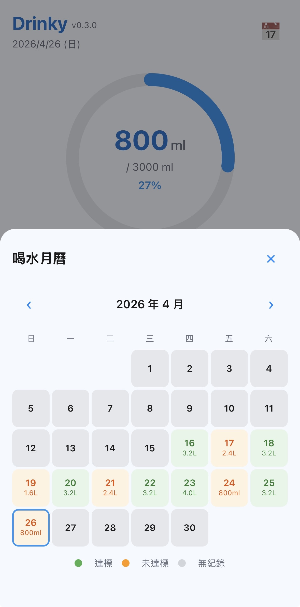
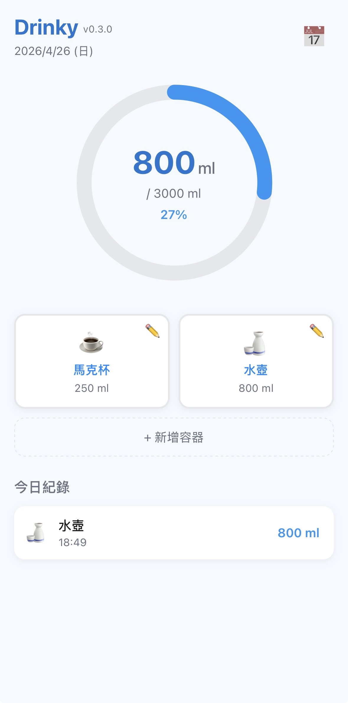
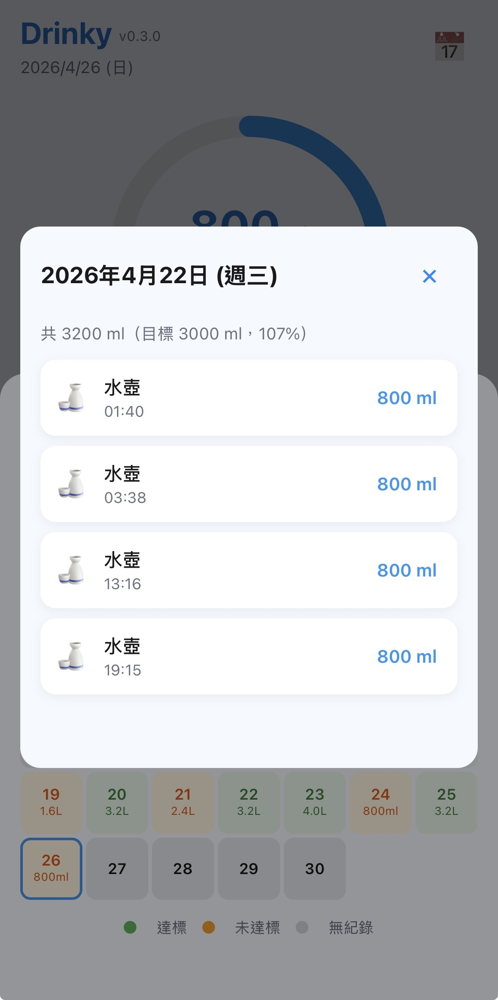

# Drinky

Drinky 是我做來記錄自己和朋友每天喝水狀況的 PWA。它的出發點不是做一個功能展示用的 demo，而是想把「每天到底喝了多少水」這件事變得更容易記錄，也更容易被看見。

我已經持續使用接近半個月。對我來說，它最大的價值不只是把數字記下來，而是讓我可以更直覺地意識到自己今天喝得夠不夠、這幾天的狀態是不是有在往好的方向走。

## 我為什麼做這個 App

一開始只是因為我想記錄自己和朋友的喝水情況，讓這件事更容易持續。喝水看起來很小，但真的要養成習慣時，如果每次記錄都麻煩，最後通常就不會記。

在做這個工具的過程中，我也接觸到了 PWA。它剛好很適合這類需求：可以直接用手機瀏覽器打開、可以加入主畫面、接近 App 的使用感，又不需要先做原生應用。這讓 Drinky 不只是一個日常使用工具，也成為我練習 PWA 的實作作品。

另外，因為它部署在 GitHub Pages 上，我可以持續更新功能和介面，而開始一起使用的朋友看到的也會是最新版本。這讓我可以用一個真的有人在用的專案，反覆驗證自己的設計和實作判斷。

## 我現在怎麼用它記錄每天喝水

我現在的使用方式很直接：白天每喝一次水，就用預設好的容器快速記一筆；想回顧時，就看首頁進度、月曆分布，或點進單日明細確認那天到底喝了幾次。

這種流程的重點不是塞很多功能，而是讓記錄這件事足夠快。只要打開後幾秒內就能完成一筆紀錄，我才會真的天天用下去。到現在為止，它已經對我每天喝水量是否足夠的可視化認知，起到了很大的幫助。

## 首頁：先看今天喝了多少

首頁的核心設計是先把「今天目前喝了多少」放在最顯眼的位置。圓形進度圖會直接顯示目前累積量、每日目標和完成百分比，讓我一打開就能知道自己現在距離目標還差多少。

下面的容器卡片是為了縮短記錄時間。像馬克杯、水壺這種我日常真的會用到的容器，可以直接點一下新增，不需要每次重新輸入數字。對我來說，這比做一個複雜的表單更重要，因為真正影響習慣是否能延續的，是操作摩擦夠不夠低。



## 月曆：回頭看這個月的喝水狀態

如果首頁解決的是「今天喝了多少」，那月曆解決的就是「這段時間喝水習慣到底穩不穩定」。我希望自己不是只看單日數字，而是能從整個月份去觀察哪些天有達標、哪些天明顯不足、哪些天甚至沒有記錄。

所以月曆裡直接用顏色區分達標、未達標與無紀錄，並把每日總量一起放進格子裡。這樣在回顧時，不需要點進去也能先建立整體印象，快速看出自己的節奏和落差。



## 單日明細：把一天怎麼喝的看清楚

有了月曆之後，我還是需要知道某一天的細節。因為總量只是結果，我有時也會想知道自己是平均分散地喝，還是其實都集中在少數幾次。

單日明細的用途就是把這件事拆開來看。它會列出當天每一筆紀錄的時間、容器和容量，並在上方直接顯示當天總量、目標和達成率。這樣我不只知道那天有沒有達標，也能回頭理解自己的實際飲水節奏。



## 這個專案裡我想練到的 PWA 能力

這個專案對我來說，不只是做出一個能用的喝水紀錄工具，也是一次把 PWA 真正落到日常使用場景的練習。我想藉這個專案熟悉幾件事：

- 怎麼把網站做成接近 App 的使用體驗
- 怎麼用 Service Worker 和快取機制支撐更新與離線使用
- 怎麼透過 Manifest 讓它可以被加入主畫面
- 怎麼在純前端架構下，維持夠簡單但實際可用的資料紀錄流程

我希望別人看到這個作品時，不只看到功能本身，也能看出我有把技術選型和使用情境一起考慮進去。

## 立即使用

- 線上版：https://willybb0120.github.io/drinky
- 建議直接用手機瀏覽器開啟，加入主畫面後使用體驗會更接近 App

## 本地開發

```bash
git clone https://github.com/willybb0120/drinky.git
cd drinky
python3 -m http.server 8080
# 開啟 http://localhost:8080
```

## 技術實作

這個專案目前是純靜態 PWA，沒有使用框架或第三方套件，直接用原生前端技術完成。

- HTML / CSS / JavaScript
- Web App Manifest
- Service Worker
- localStorage
- GitHub Pages
